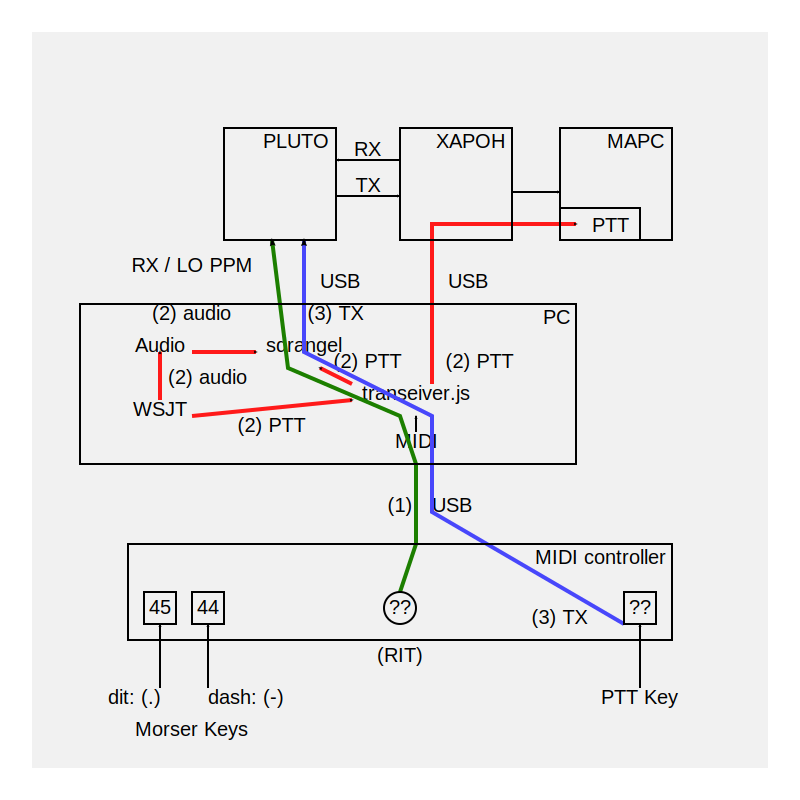

NodeJS scripts for SDRangel

## Transceiver

* Setup RX, TX from config file
* Lock RX -> TX delta F

```
./bin/transeiver.js
```


# Retime JS & Tweaktime

A collection of utilities to adjust system time manually and incrementally. Includes the original C++ `tweaktime` utilities and a Node.js integration for `sdrangel-node`.

## Requirements
- Node.js (v10+)
- G++ (for compiling C++ utilities)
- Linux (for capability-based adjustments)

## openSUSE Tumbleweed Installation
To install the necessary build tools and dependencies:
```bash
sudo zypper install gcc-c++ make libcap-progs
```

## Build Instructions
To compile the C++ `tweaktime` and `ctweaktime` utilities:
```bash
cd tweaktime
make
```

## Permissions (Linux)
Changing the system clock is a privileged operation. For the best performance without running Node.js as root, you can grant the `CAP_SYS_TIME` capability to the compiled binary:

```bash
# Allow the binary to change system time for any user
sudo setcap cap_sys_time+ep ./tweaktime/tweaktime
```

Alternatively, you can use the traditional `setuid` method:
```bash
sudo chown root:root ./tweaktime/tweaktime
sudo chmod +s ./tweaktime/tweaktime
```

## Usage

### Integrated with Transceiver (Recommended)
The functionality is integrated into `../bin/transceiver.js`. When running the transceiver:
- `<` or `,` : Retard clock by current step.
- `>` or `.` : Advance clock by current step.
- `+` or `=` : Increase adjustment step size.
- `-` or `_` : Decrease adjustment step size.

### Standalone JS Utility
Adjust the clock by a fixed amount of milliseconds:
```bash
sudo node tweaktime.js +100
sudo node tweaktime.js -50
```

### Standalone C++ Utility
```bash
./tweaktime/tweaktime +100
./tweaktime/ctweaktime  # Interactive mode
```

## Implementation Details
The integrated version in `sdrangel-node` uses a multi-tier approach for maximum performance and reliability:
1. **Binary:** Executes the compiled `tweaktime` C++ binary (fastest when `setcap` is applied).
2. **Sudo Binary:** Falls back to `sudo tweaktime` if permissions are not set.
3. **Date Command:** Last resort using the system's `date -s` command.

### Test Time offset

```
sudo chronyd -Q "server pool.ntp.org iburst"
```
